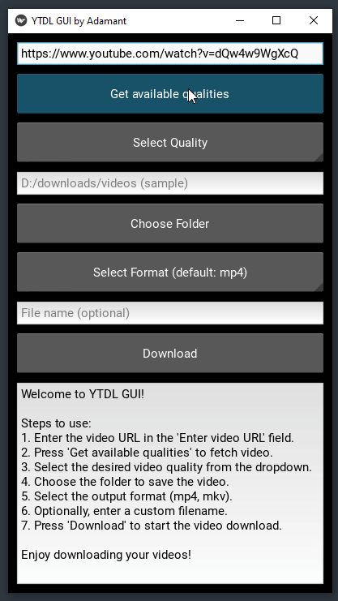

# YTDL GUI by Adamant

A simple graphical user interface (GUI) to download videos using [yt-dlp](https://github.com/yt-dlp/yt-dlp). This application allows you to easily input a video URL, select download quality, format, and destination folder, and start the download process.

## Requirements

### FFmpeg
FFmpeg is required for video conversion during the download process. 

#### Windows:
1. Download FFmpeg from [https://ffmpeg.org/download.html](https://ffmpeg.org/download.html).
2. Extract the contents and add the path to FFmpeg's `bin` folder (e.g., `C:\ffmpeg\bin`) to your system's PATH environment variable.

#### Linux:
You can install FFmpeg using your package manager:
```
sudo apt-get install ffmpeg
```

#### macOS:
To install FFmpeg on macOS, use Homebrew:
```
brew install ffmpeg
```

# Installation

1. Clone the repository:
```
git clone https://github.com/adamant-antithesis/yt_dlp_gui.git
```
2. Create a virtual environment (optional but recommended):
```
python -m venv venv
```
3. Activate the virtual environment:
```
On Windows - env\Scripts\activate
On macOS and Linux - source env/bin/activate
```
4. Install dependencies:
```
pip install -r requirements.txt
```
5. Run the App:
```
python ytdl_gui.py
```

# How to Use

1. Enter Video URL
```
In the input field at the top, enter the URL of the video you want to download.
```
2. Fetch Available Qualities
```
Click the "Get available qualities" button to fetch the available video qualities from the video URL.
```
3. Select Video Quality
```
After the available qualities are loaded, select the desired quality from the drop-down list.
```
4. Choose Download Format
```
Select the format in which you want the video to be downloaded (the default is mp4).
```
6. Select Folder
```
Choose the folder where you want to save the downloaded video.
```
7. Start Download
```
Click on the "Download" button to begin the download process.
```


## Log Output Example
```
Checking available qualities...
Found 3 formats.
Title: Example Video Title
Available qualities loaded.
Starting download (1080p) in mp4 format...
Downloading: 50% at 1.2MB/s
Download complete, merging files...
Merging formats...
Download and merging completed!
```
